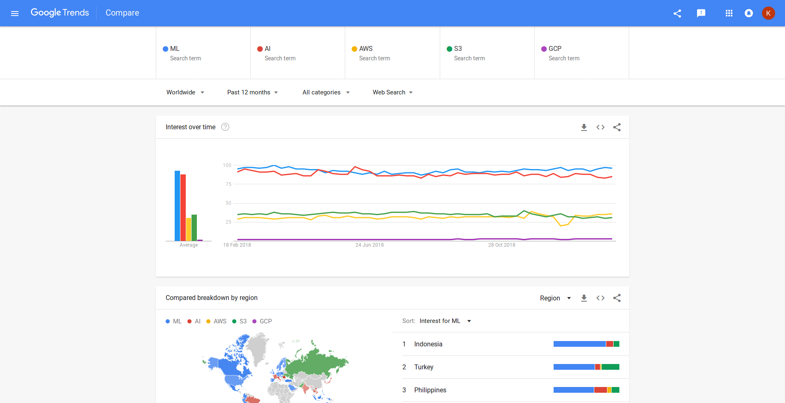
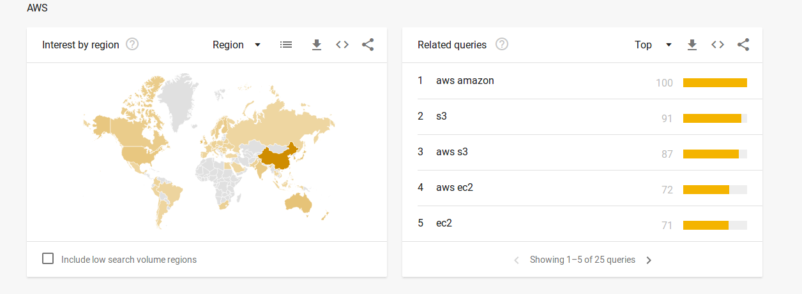

## Top most commonly used Abbreviations


## List of abbreivations from
[This link](https://geekflare.com/tech-abbreviations/) has A list of Acronyms used in technology.
Lets run them through Google Trends and find out the most commonly accoring ones and list them out.





Amazing tool!
Though, it has a limit that you can only have 5 query string.
But the also have an npm package we could use, so let get some JavaScript going.

```

```
