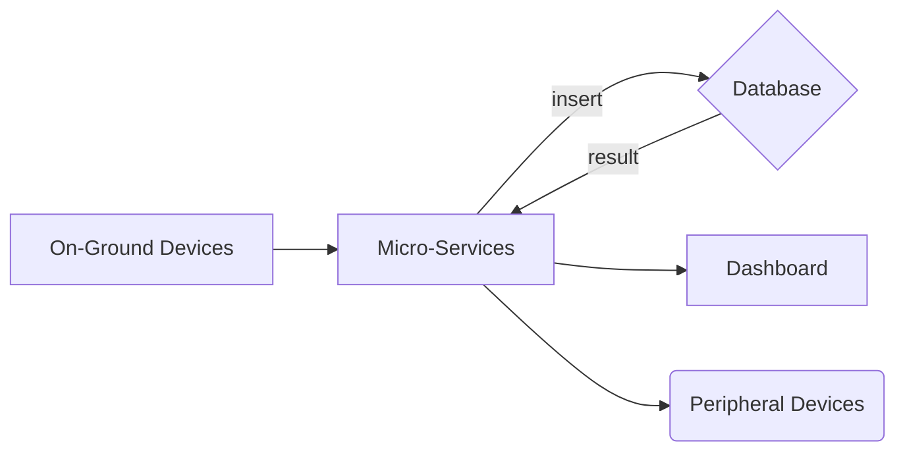
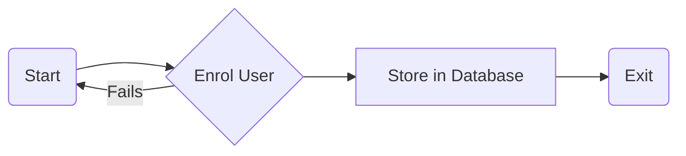
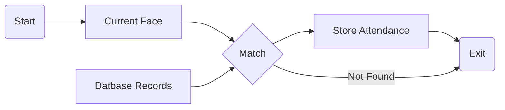

# FaceBox

Manual attendance taking and report generation has its limitations. It is well enough for 30-60 students but when it comes to taking attendance of students large in number, it is difficult.
 For taking attendance for a lecture, a conference, etc. roll calling and manual attendance system is a failure. Time waste over responses of students, waste of paper etc. are the disadvantages of manual attendance system. Moreover, the attendance report is also not generated on time. To overcome these non-optimal situations, it is necessary that we should use an automatic on-line attendance management system. 
 So we present an implementable attendance management framework. Student attendance system framework is divided into three parts :
 * Hardware/Software Design
 *  Attendance Management Approach 
 *  On-line Report Generation

 Each of these is explained below.

  

## Hardware Level Design

Required hardware used should be easy to maintain, implement and easily available. Proposed hardware consists following parts:

1. Camera

2. LCD/Display Module (optional),

3. Compute Stick

4. Network Access

  

## Software Level Design

#### Currently Availble
Here is a list of current Face Recognition enabling technologies available:
__Paid__
* Google Cloud Vision
IBM Watson Visual Recognition (https://console.bluemix.net/apidocs/visual-recognition#detect-faces-in-an-image)
* Microsoft Face API (https://azure.microsoft.com/en-in/services/cognitive-services/face/)
* Amazon Rekognition (https://aws.amazon.com/rekognition/)
* Kairos (https://www.kairos.com/)

__OpenSource/Self-hosted__
* face_Recognition: Python: dlib
* OpenBR
* OpenFace: Using Python: Torch
* `Many more`: Using Python: OpenCV

### Our Solution
The facebox solution is to use the best of both worlds.
-  We leverage a self-hosted high presision _object detection modules_.
-  Isolate `people` in the frame, and get cropped image of `face` of `person`.
- Each minified image of person is fed to a high pression paid _face detection module_.
- Maintain telemetry on our servers (attendence++).

### Proposed Tech-stack
Proposed technology choices:

1. MongoDB | ( Firebase for protyping)
2. ExpressJS | ( Firebase for protyping)
3. Angular | For Dashboarding
4. AWS Lambda or similar (Node 8+)  | Required Microservices 
5. RaspberryPi + USB Camera | Base Module
6. ESP32 | Peripheral Devices 
7. AWS Rekognition | _face detection module_
8. OpenCV | _object  dectection module_

  
  

## Attendance Management Approach

This part explains how students and teachers will use this attendance management system. Following points will make sure that attendance is marked correctly, without any problem:

1. All the hardware will be inside classroom. So outside interference will be absent.

2. When teacher enters the classroom, the attendance marking will start. Computer software will start the process after inputting fingerprint of teacher. It will find the Subject ID, and Current Semester using the ID of the teacher or could be set manually on the software. If teacher doesn’t enter classroom, attendance marking will not start.

3. After some time, say 20 minutes of this process, no attendance will be given because of late entrance. This time period can be increased or decreased as per requirements.

  

## Face Identification System

  

An identification system is one which helps in identifying an individual among many people when detailed information is not available. It may involve matching available features of candidate like Face with those already enrolled in database

  

### How Face Recognition works?

  

Face images that are found or scanned are not of optimum quality. So we remove noises and enhance their quality. We extract features like minutiae and others for matching. If the sets of minutiae are matched with those in the database, we call it an identified face. After matching, we perform post-matching steps which may include showing details of identified candidate, marking attendance etc.

  

### System Flowchart

  

- On-Ground Devices

>  1. Change in frame is detected

>  2. Face is found in frame

>  3. Micro-Service Called

  

- Micro-Services

>  1. Gets the face from On-Edge Device

>  2. Insert/Search for Face in AI powered engine

  

- Database

>  1. Insert Face dataset (OnBoarding)

>  2. Search for face dataset

  

- Dashboards

>  1. Generates Reports

>  2. Predicts patterns

>  3. Displays useful insights

  

- Peripheral Devices

>  1. Enables an actuators

  

  

## Project Planning

Here we describe the brief objectives of the FAS project and set out the constraints which affect the project management.

  

### Objectives

- Computerize the daily attendance system

- Attendance by face

  

### Method

A rough task breakdown for this project is as follows:

- Examine and review available literature on image enhancement and minutiae extraction techniques.

- Develop a series of image enhancement techniques to aid the minutiae extraction process.

- Develop a set of reliable techniques to extract the minutiae from face images.

- Evaluate the performance of the techniques using the face data set.

- Use existing techniques as the benchmark for comparing the performance of the technique developed.

- After reliable minutiae detection techniques have been developed and tested, then statistical analysis experiments on the face data set can be performed and documented.

  

Onboarding User

  

Matching User

  

## Conclusion

  

This project mainly comprised of development of attendance management system and face identification system. Attendance management is very helpful in saving valuable time of students and teachers, paper and generating report at required time. This project presented a framework using which attendance management can be made automated and on-line.
