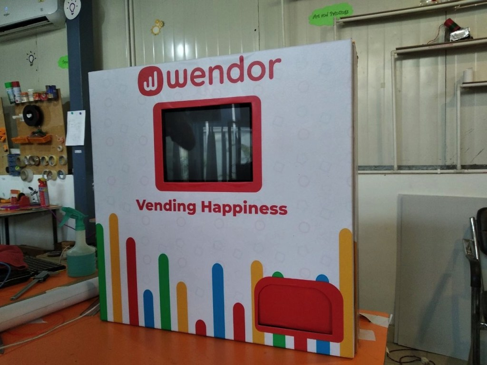
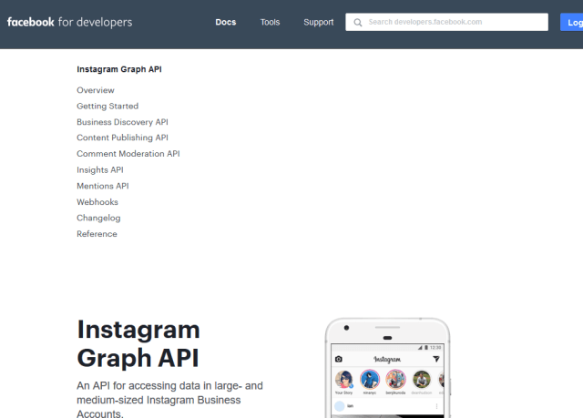
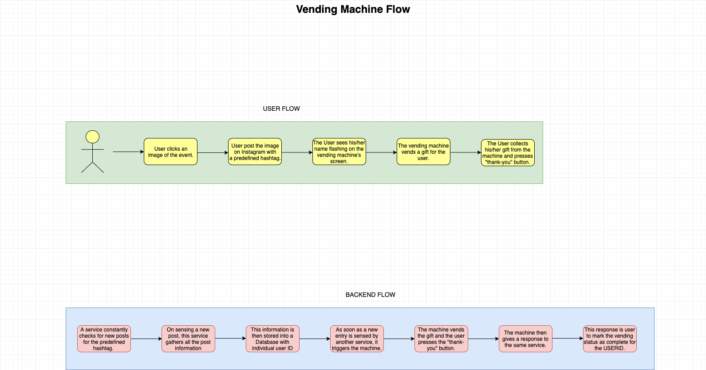

## Megaboxing Vending Engagement

## Summary
A growth hack for Brand activation and empowering social media presence.
This Megaboxing Vending machine aims to use `Instagram Hashtags` as the trigger for Brand activation.

These hashtags would be following:
 * #BoxWinner

```
Please provode a hastag for megaboxing event, if change needed.
```

[Wendor Mini](https://www.wendor.in/healthcare/) - a sleek Vending machine.



[Instagram Graph API](https://developers.facebook.com/docs/instagram-api/) - The Instagram Graph API allows apps to access data in Instagram Business Accounts and Instagram Creator Accounts. By using the API, you can build apps that help Businesses and Creators manage their photos, videos, stories, albums, comments, and hashtags at scale, as well as measure social interactions with other Instagram users.



## User flow diagram


## Actions at venue
* Poster/Sticker for the Body - Size with Megaboxing team
* Content for Flyers/descriptors/Messages of this. How to etc.
* Wifi - SSID and password
* Power - Standard 220V supply
* Merchendise to despense (count to be determined) - Machine capacity 50/filling

## POC at venue
* Ashtam Singh - +91-6395973808
* Sarthak Verma - +91-8979080101
* Rachit Shah - +91-8824847533

## Completed Tasks
* Override Wendor Mini default controller, for custom actions
* Setup intagram Listener for Hastag of public profile
* Instagram DM service - Fullfilment / Vending Code
* Persist usage statistics

## Ongoing Tasks
* Web UI for onboard screen on Wendor Mini
* Usage Reports
* Package boxing standards 

## Items to Buy
* Servo x 2 - Lowermost tray non-functional 
* Lock - Done
* IR module 

