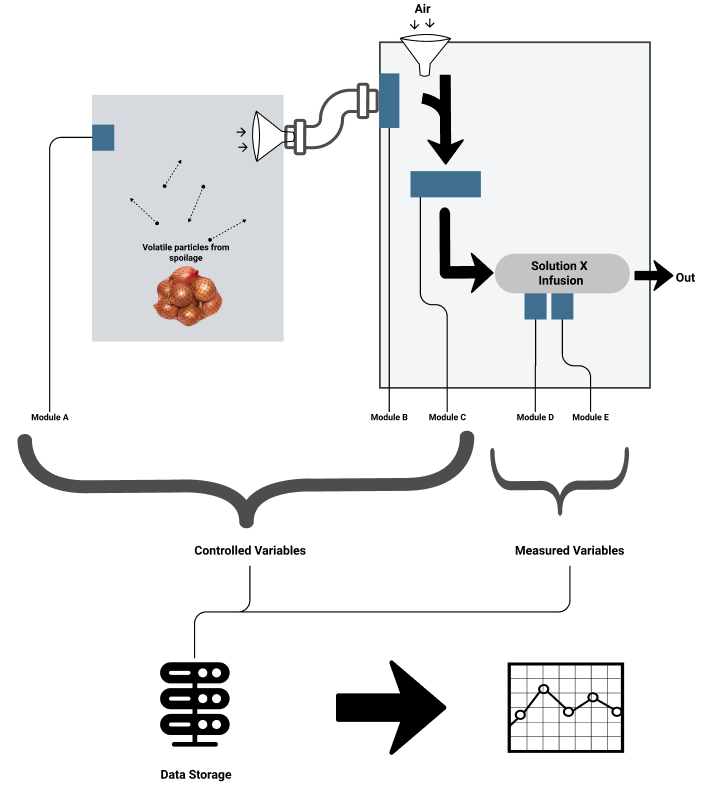
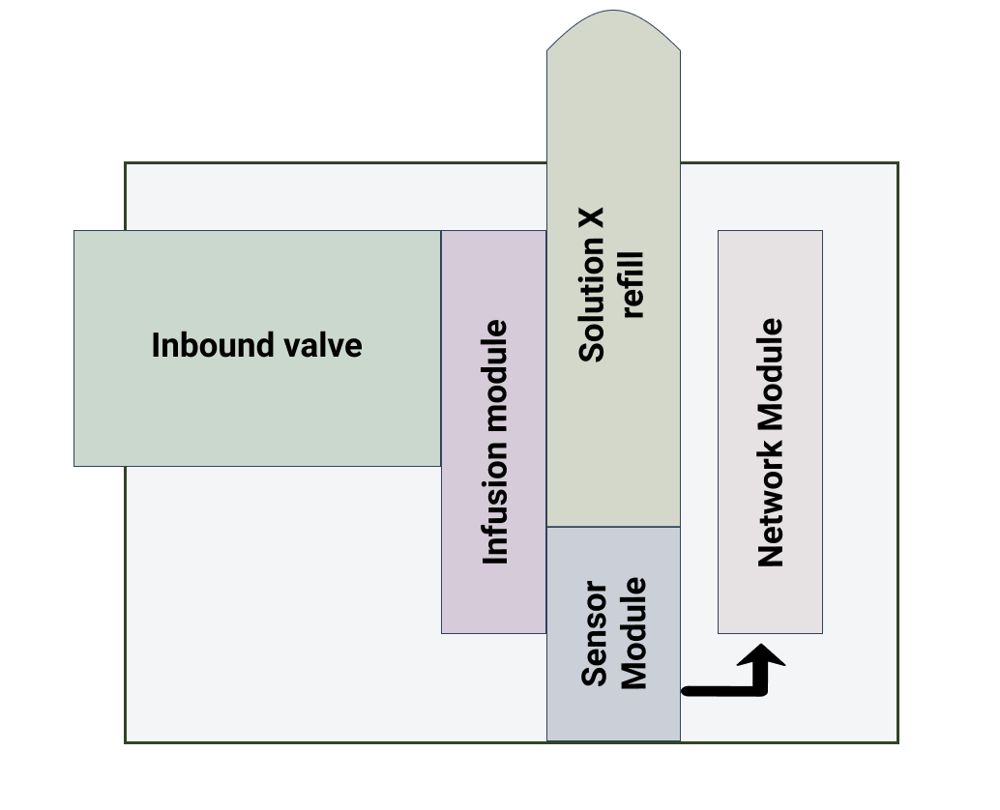

## Spoilage detection - SOW
Document prepared by Kartik Arora

## Table of Content

* Executive Summary
* Project Definition
* Devices
* Web/Soft-ware
* Maintenance
* Exclusions
* Deliverables
* Customer Responsibilities
* Investment and Cost
* Acceptance Criteria
* Assumptions
* IPR
* Approvals


## Executive Summary
This documentation is to serve as a 'Statement of Work' or SOW for design and development of a Spoilage detection product for --xx-- to enable and enhance `the business`. The advancement in the field of IoT 
Networks, Computing and Data Science has made possible Integrated systems that can help this use-case.
Such a system would include a means to capture, catalogue and analyze data, along with tools to further optimize and maintain this operation.

The current scenario, we have identified a solution X, which response predictably and with high confidence towards volatile compounds released while spoilage. 

Akriya Technologies will work with --xx-- to:

* Designing the Quantification Module
* Designing the Spoilage detection EndPoint Module
* Make the EndPoint Module market-ready
* Provide documentation of the new system
* Knowledge Transfer/Integrate for operations/maintenance


The Value Proposition of using Akriya Technologies for this project are:
* Proven engineering techniques for making Integrated systems.
* Leveraging our experience in working with IoT toolkit (ESP).
* Data Architecture and Solution experience
* Using our subject matter experts to complete the project quickly. Rapid project completion minimizes disruptions and allows organizations to realize cost-saving quickly.

## Scope
Given a solution X, which response predictably and with high confidence towards volatile compounds released while spoilage, the aim to deliver a market-ready product to help detect spoilage in different industrial as well as domestic settings.

To achieve this task, we have broken this down to the following 4 modules.

* Quantification Module
We can achieve this by collecting and analysing data by testing our Solution X in a controlled environment.
This would help generate enough labelled data to help us the model and design a portable sensor.
To collect this data, the following setup for the Quantification Module is proposed: 





* Prototyping of EndPoint Module
The EndPoint modules are portable versions of the Spoilage detection mechanism, which would help detect spoilage using Solution X properties. The design and development of the module would be to provide:

    - Ease-of-use for consumers/operators
    - Maximize throughput of Solution X consumption
    - Deployable in varied conditions
    - Pocket-friendly

    The following provides a rough diagram based on the current understanding of Solution X.


    

* Market ready
To drive usage and adoption of the EndPoint modules of spoilage detection.

* Operations and Maintenance
Standard maintenance and operations process to help manage the fleet of devices in the market.


## Devices/HW

* Quantification Module A

```
Data to Capture:    amount of raw
                    humidity
                    temprature
                    pressure

```

* Quantification Module B

```
Data to Capture:    Volatile material base telemetry
                    
```


* Quantification Module C

```
Data to Capture:    pressure
                    temprature
                    concentration

```


* Quantification Module D

```
Data to Capture:    optics based telemetry

```

* Quantification Module E

```
Data to Capture:    conductivity based telemetry

```


## Web/Software
* Quantification Telemetry Engine
We will be recording and cataloguing the real-time telemetry from the Quantification Modules.
This would include endpoints, to allow view, query and analyse this set.


* EndPoint Companion App
Provide access control to the Endpoint device.

## Maintenance
To be maintained for 6 months and then rediscuss based on new requirements and learnings.

## Exclusions
The followings are excluded from the project scope
* The packages used and maintained by Akriya Technologies for interfacing with IoT Devices.

## Deliverables
The deliverables are listed below.
* Devices. 
TBD

* Software
Access top-level Git repositories for the Dashboard, mobile Apps, and admin interface package.

* Documentation and graphical depictions of the system.


## Customer Responsibilities
* The nature of this engagement dictates that Akriya Technologies receive a frequent and enthusiastic response from the appropriate personnel.
* A weekly review between the Akriya Technologies consultant and the --xx-- project lead or his designate will ensure that the expectations of this engagement are met.
* Client will assign a key contact who will be responsible for providing Akriya Technologies with information, access to personnel, and facility access.
* Client will provide a work area space with desk, chair, Internet access for use by Akriya Technologies to conduct project business while working on-site.

## Investment and Cost
* Man-hour required: `TBD`

* Hardware cost (if required) to be paid by --xx--
    
* Server/Web hosting charges (approx):
    * 60$ / month = 4000 INR

* Bill separately for travel costs will be billed at actual cost and will not exceed 10,000 INR for the entire project.

 * Payment Schedule
    `TBD`
Devices cost to be paid on the day of installation.
Server cost to be paid directly or at the start of each month.
Travel reimbursements as and when declared.

## Acceptance Criteria
At the conclusion of this evaluation, all deliverables for this phase will be presented to --xx-- for review.

--xx-- or its representative will have five business days from the date of delivery of any document that is a deliverable to review it and request any changes.  If Akriya Technologies does not receive notification of any required changes within this period, the document will be deemed to have been accepted without modification and will be reissued as a final copy.

If Akriya Technologies is notified by --xx--, within the above time frame, of any changes required, Akriya Technologies will within two business days of such notification implement those changes as have been agreed between the parties.  A final copy of the document will then be submitted to --xx--.

## Assumptions
* General
    * All documentation created for this project will be available in hard copy and electronic format.
    * Any modifications to the scope of work will be handled through a change control process and will be agreed to by both parties.

* Commercial
    * Additional costs may be incurred where any delay not under the control of Akriya Technologies that causes Akriya Technologies personnel to not fulfil their scheduled tasks.
    * An authorized delegate of --xx-- will be available at the time of completion of the build phase so that all documentation can be accepted and signed.
    * Additional costs may be incurred where any work scheduled to be undertaken by Akriya Technologies is postponed by --xx-- after 24 hours of its commencement.
    * All changes to the schedule or technical requirements must be provided to Akriya Technologies in written format. Email is included as written format. Receipt of all correspondence should be confirmed by phone wherever possible.
    * --xx-- has accepted the costs/times estimate as detailed in this document
    * --xx-- has accepted the Akriya Technologies standard terms and conditions linked.

## Intellectual Property
Unless otherwise agreed in writing, --xx-- acknowledges that all intellectual property rights attaching to the products or arising out of the provision of services are and will remain the property of Akriya Technologies (or its suppliers, where such rights are owned by that supplier).

The software will be licensed to --xx-- on the terms of the relevant license agreement provided with the product or as otherwise agreed between Akriya Technologies and --xx-- in writing.


## Approved by
Name:   
Date:   
Position:   

